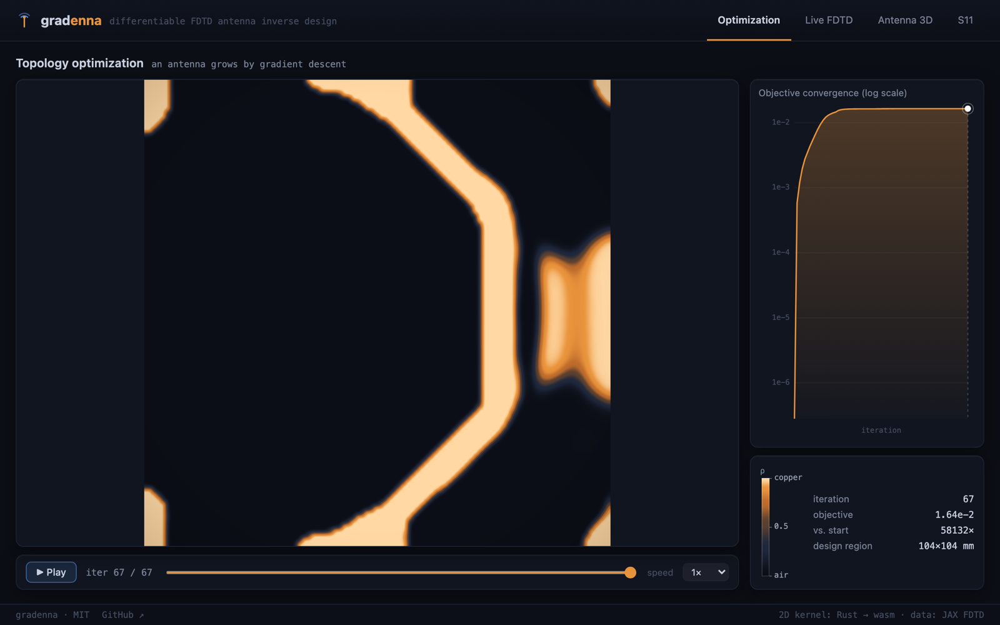
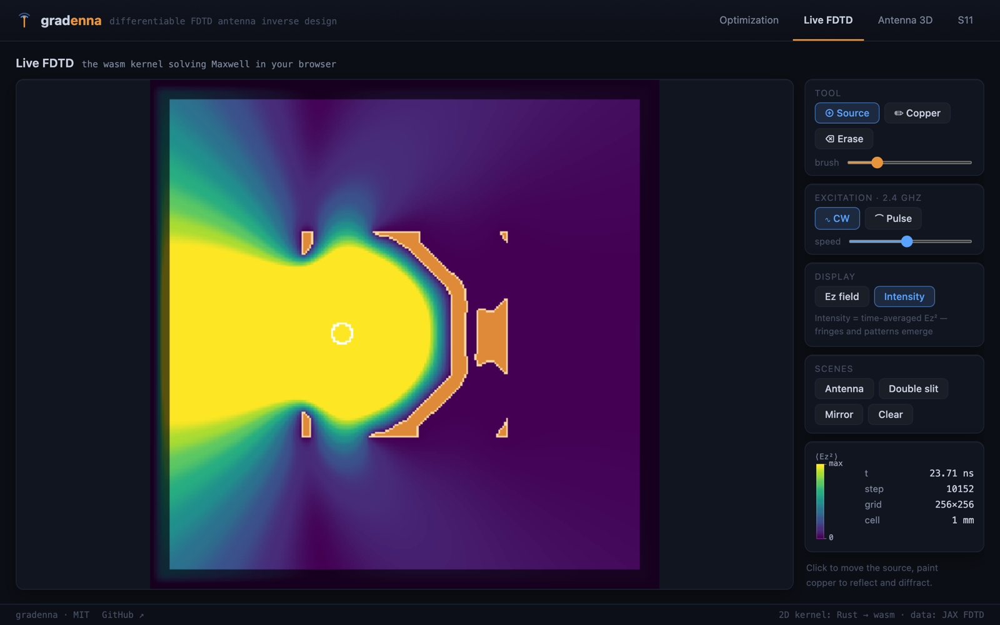
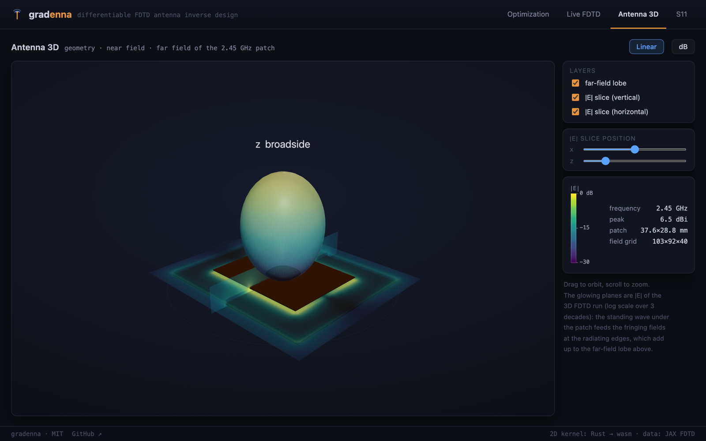
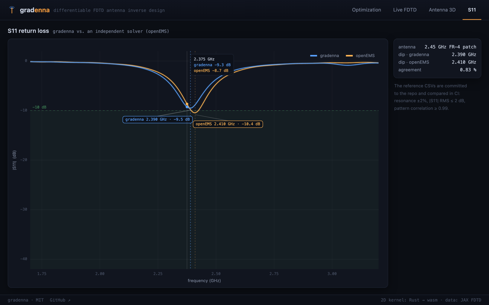

# gradenna

[](https://github.com/s-hosomi/gradenna/actions/workflows/ci.yml)

**grad**ient + ant**enna** — JAX で書いた微分可能 FDTD によるアンテナ逆設計。RF アンテナを勾配降下で「育てる」。

[English README](README.md)

<p align="center">
  
</p>
<p align="center">
  <em>一様グレーの設計領域からアンテナが生えてくる。104×104 ピクセルの設計領域（1 mm セル）を
  微分可能な Maxwell ソルバーごしに Adam 200 イテレーションで最適化し、2.45 GHz の放射電力を
  最大化 — 目的関数は初期設計の <strong>58,000 倍</strong>に。形状は一切手で描いていません。</em>
</p>

gradenna は RF/マイクロ波アンテナ設計のための、完全微分可能な電磁界（FDTD）ソルバー＋トポロジー最適化ツールキットです。Yee 更新・CPML 吸収境界・50Ω 集中ポート・ランニング DFT による S パラメータ・近傍場→遠方場変換（NTFF）までのシミュレーション全体が単一の JAX 計算グラフになっており、`jax.grad` 一発で任意の目的関数（S11・放射電力・指向性・利得）の**全設計ピクセル同時の**厳密な随伴勾配が得られます:

```python
import jax, jax.numpy as jnp
from gradenna import (Grid2D, CPMLSpec, Port, simulate_tm,
                      gaussian_pulse_for_band, sigma_from_density,
                      poynting_flux_box_2d)

grid = Grid2D(nx=140, ny=140, dx=2e-3, dy=2e-3)
pulse = gaussian_pulse_for_band(2.0e9, 3.0e9)
t = (jnp.arange(3500) + 0.5) * grid.dt

def neg_radiated_power(rho):                      # rho: 0 = 空気, 1 = 銅
    sigma = jnp.zeros(grid.shape).at[44:96, 60:112].set(sigma_from_density(rho))
    res = simulate_tm(grid, sigma=sigma, dft_freqs=(2.45e9,),
                      ports=(Port(ij=(70, 55), resistance=50.0, voltage=pulse(t)),),
                      cpml=CPMLSpec(thickness=10))
    return -poynting_flux_box_2d(res.dft_ez, res.dft_hx, res.dft_hy, grid,
                                 box=(20, 120, 20, 120))[0]

grad = jax.grad(neg_radiated_power)(0.5 * jnp.ones((52, 52)))  # 逆方向パス 1 回
```

## インタラクティブ・ビジュアライザ

**[ライブデモを開く →](https://s-hosomi.github.io/gradenna/)** — ローカル実行は
`cd web/app && npm install && npm run dev`。上記すべてを見られる three.js ビューアで、
**26 kB の Rust→wasm カーネルによるブラウザ内ライブ 2D FDTD ソルバー**込みです
（データは生成済みでコミットされています）。

<table>
  <tr>
    <td width="50%">
      
      <p align="center"><sub><b>Optimization</b> — 上の成長アニメを GPU バイキュービック
      補間・スクラブ・対数収束カーブつきで再生</sub></p>
    </td>
    <td width="50%">
      
      <p align="center"><sub><b>Live FDTD</b> — 最適化されたアンテナを wasm カーネルが
      ライブ駆動。時間平均強度に指向性ビームが浮かび上がる。銅の描画・ソース移動・
      ダブルスリット/ミラーのシーンも</sub></p>
    </td>
  </tr>
  <tr>
    <td width="50%">
      
      <p align="center"><sub><b>Antenna 3D</b> — 実寸のパッチ形状、3D 計算の |E| 近傍場が
      ドラッグできるスライス面に発光し（放射端のフリンジング場が見える）、その上空に
      遠方界ローブ — 物理のストーリー全体がひとつの回転できるシーンに</sub></p>
    </td>
    <td width="50%">
      
      <p align="center"><sub><b>S11</b> — 同一アンテナでの gradenna vs 独立ソルバー
      openEMS: ディップ差 0.83%、RMS 差 0.51 dB</sub></p>
    </td>
  </tr>
</table>

データの再生成は `scripts/export_viz.py`。wasm のビルドと GitHub Pages への
デプロイは `web/app/README.md` を参照。

## 特徴

- **微分可能な 2D TM / フル 3D FDTD コア**（`jax.lax.scan`、jit 可、float32/float64）、CPML/CFS 吸収境界、複数ソース、√N 勾配チェックポイント
- **集中 RVS ポートと S パラメータ**: 半陰的な抵抗付き電圧源ポート、厳密位相ランニング DFT、パワー波 S11、離散ギャップサセプタンスのデエンベッディング
- **微分可能 NTFF**（2D/3D）: 放射電力・指向性・利得を最適化目的に
- **トポロジー最適化ツールキット**: conic 密度フィルタ、tanh 射影＋β 継続、対数導電率の金属補間、連結性・最小線幅チェック
- **製造パイプライン**: 密度マップ → ポリゴン → RS-274X Gerber（JLCPCB デザインルールチェック付き、`pip install gradenna[fab]`）。ベンチマークパッチの発注可能パッケージは `fab_campaign/` に
- **実測ループ**: Touchstone 入出力、sim vs 実測 S11 比較、NanoVNA 取得スクリプト（`pip install gradenna[measure]`）
- **微分可能な細線 MoM バックエンド**（`gradenna.mom`）: 自由空間 PEC ワイヤの区分正弦 Galerkin EFIE。形状（長さ・半径）を `jax.grad` で微分できる高速サロゲート。基板対応（層状媒質グリーン関数）は将来課題

## コンシューマハードウェアで速い — GPU と Apple Silicon

微分可能 RF FDTD の先行研究はデータセンター GPU（中解像度 3D アンテナで GPU あたり
~90 GB）を前提にしています。gradenna は同じ問題が**手元のハードウェアで回る**ことを
設計目標にしています:

| | |
|---|---|
| 3D パッチのトポロジー最適化（フル解像度） | ピーク **7.7 GB**（float64）/ **~3.9 GB**（float32）— 24 GB コンシューマ GPU に収まる |
| 3D の CPML 補助変数（ψ）メモリ | PML スラブ格納で **−74%** |
| 随伴勾配のメモリ | residual は **O(設計セル × 周波数)** — タイムテープ不要（周波数領域随伴） |
| 2D 融合 Rust カーネル（Apple M1 Pro） | 1024² float32 で **5,040 Mcell-steps/s** — XLA CPU 比 **8.4 倍** |
| 3D 融合 Rust カーネル（Apple M1 Pro） | 96³ で **796 Mcell-steps/s**（2.4 倍）。DFT 主体の勾配はさらに領域限定 DFT で **2.35 倍** |

- **メモリ有界な 3D 随伴**: ψ の PML スラブ格納＋√N 勾配チェックポイント。`gradenna.fdtd3d_memory_estimate` が起動前にメモリ予算を予測し、`examples/optimize_3d_patch.py` の `gpu-24gb` プリセットがそれを表示・assert します。
- **float32 一気通貫**: トポロジー最適化は素の float32（DFT は complex64）で動作 — コンシューマ GPU のネイティブ精度。ソース〜モニタ間の減衰が極端な場合のみ `dft_dtype=jnp.complex128` で DFT 蓄積器だけ昇格。
- **周波数領域随伴（2D・3D）**: 目的関数が周波数領域量（S11・流束・遠方界）のみに依存する場合、`simulate_tm_freq` / `simulate_3d_freq` は**順方向シミュレーション 2 回**で勾配を計算 — タイムテープ不要。完全 AD を正解とした検証で両次元ともコサイン ≥ 0.9999997。**3D の NTFF 指向性目的**まで対応 — 実 3D アンテナの微分可能な利得最適化が O(設計セル) メモリで可能。磁気コタンジェント結合定数は閉形式 −ε₀/μ₀（Yee シンプレクティック計量比）として導出済み。
- **設計領域限定 DFT モニタ（3D）**: `simulate_3d(dft_regions=...)` はランニング DFT を成分ごとの静的スラブ上だけで蓄積し、`freq_adjoint_gradient_3d(objective_kind="port" | "ntff_box" | "field")` がそのスラブを自動導出 — 勾配縮約に使う設計領域の E 成分と、目的関数が読むセルだけ。勾配は全格子パスと一致（コサイン ≥ 1−1e−12）したまま、DFT キャリーは全格子 6 成分からスラブへ縮小。
- **融合 Rust カーネル（オプション、ARM チューニング）**: 2D/3D タイムループをキャッシュフレンドリなマルチスレッドネイティブカーネルにコンパイル（初回 cargo build、Rust 無し環境は自動フォールバック）。スレッド数・タイリングは Apple Silicon コアで実測チューニング。周波数領域随伴は forward/adjoint の両パスをカーネルで実行（`backend="native"`、勾配パリティ検証済み）。`scripts/benchmark.py --backend native` で数値を再現できます。

## 検証

全物理コンポーネントを解析解・教科書値・独立ソルバーに対して CI でテストしています（175+ テスト）:

| ベンチマーク | 結果 |
|---|---|
| 線電流の円筒波 vs `H0^(2)(kρ)`（Harrington） | プロファイル誤差 <2.5%、2次グリッド収束 |
| CPML 反射（拡大領域リファレンス比較） | −92 dB（基準 −60 dB） |
| 2D 線電流の放射抵抗 vs ωμ0/4 | 1.3–2.4% |
| 微小ダイポール放射抵抗 vs 80π²(l/λ)² | デエンベッド後 0.34% |
| NTFF 経由のダイポール指向性 vs D₀=1.5 | 0.14% |
| 2.45 GHz FR-4 パッチ共振 vs Balanis 設計式 | −2.5% |
| 2.45 GHz パッチ vs openEMS（コミット済み参照データ） | 共振 0.83%、\|S11\| RMS 0.51 dB、パターン相関 ≥ 0.999 |
| 細線 MoM ダイポール共振 vs 教科書値（0.47–0.48 λ、~72 Ω） | L_res = 0.476 λ、Re Zin = 71.7 Ω |
| ビームステアリングのメインローブ vs 配列因子理論 | −30°/0°/+30° で ±5° 以内 |
| `jax.grad` vs 有限差分（全パラメータ種別） | 相対誤差 ≤1e-4 |
| チェックポイント随伴 vs 素朴随伴 | ビット一致 |

## デモ

| スクリプト | 内容 |
|---|---|
| `examples/optimize_2d_antenna.py` | 成長デモ: 2.45 GHz 放射エネルギー最大化、最終設計は完全二値（冒頭の GIF は同じ問題の 1 mm 解像度版 — `scripts/export_viz.py`） |
| `examples/optimize_directivity.py` | 遠方界変換ごしのビーム整形: D(0°) 0.31 → 4.47、F/B 比 16.8 dB |
| `examples/optimize_multiband.py` | 2.0 + 3.0 GHz 同時の最悪帯域（softmin）放射電力 |
| `examples/optimize_beamsteering.py` | **ビームステアリング**: 4 素子 λ/2 アレイの複素給電重みを遠方界変換ごしに最適化 |
| `examples/optimize_3d_patch.py` | **3D トポロジー最適化**: 実 FR-4 パッチ積層上の銅密度、チェックポイント随伴。`--preset cpu-demo`（約 2.5 分で放射電力 39 倍）/ `--preset gpu-24gb` |
| `examples/patch_to_gerber.py` | Balanis パッチ設計 → 密度マップ → DRC → Gerber |

## クイックスタート

```bash
git clone https://github.com/s-hosomi/gradenna && cd gradenna
uv sync                                  # または: pip install -e ".[fab,measure]"
uv run pytest -m "not slow" -q           # 高速検証スイート（CPU で 1〜2 分）
uv run python examples/optimize_2d_antenna.py
```

CPU だけでそのまま動きます（全デモが数分で完了）。JAX の GPU/TPU バックエンドも無変更で動作します。

## なぜ微分可能 FDTD か

50×50 の設計領域は 2500 自由度。勾配を使わない手法（GA・ピクセル反転）は世代あたり数千回のシミュレーションを要しますが、随伴法 — leapfrog の Maxwell ソルバーに対して reverse-mode AD が自動かつ厳密に実行するもの — は、パラメータ数によらず**約 2 回分のシミュレーションコストで全勾配**を返します。gradenna はフォトニクス逆設計で実証済みの機構を、導体損失・集中給電・製造制約で問題の性質が変わる RF 帯へ持ち込みます。

## ロードマップ

- [x] Phase 1 — 微分可能 2D TM FDTD コア、CPML、解析解・勾配検証
- [x] Phase 2 — 集中ポート・S11・ランニング DFT モニタ
- [x] Phase 3 — 2D トポロジー最適化（密度法・β 継続）
- [x] Phase 4 — 3D コア、パッチベンチマーク、Gerber 出力、測定ツール
- [x] Phase 5 — 遠方界の指向性・マルチバンド目的
- [x] GPU メモリ最適化（ψ の PML スラブ格納、√N チェックポイント、float32 目的関数）、3D トポロジー最適化
- [x] 周波数領域随伴（勾配＝順方向2回、タイムテープ不要）と融合 Rust CPU カーネル — 2D・3D 両対応
- [x] 設計領域限定 DFT モニタ（DFT 主体の 3D 勾配計算でのカーネル高速化を解禁）
- [x] openEMS クロスチェック参照データ（CSV コミット済み、CI で比較）
- [x] Phase 5 拡張 — アレイ・ビームステアリングデモ、微分可能細線 MoM バックエンド（自由空間）
- [x] Web ビジュアライザ — three.js ビューア + Rust→wasm ブラウザ内 FDTD カーネル
- [ ] PCB 製造 + NanoVNA 実測キャンペーン — 発注可能な Gerber/ドリル一式と手順書を `fab_campaign/` に用意（プローブ給電のベンチマークパッチ、JLCPCB DRC クリア）。物理的な発注・実測が残り

## ライセンス

MIT
